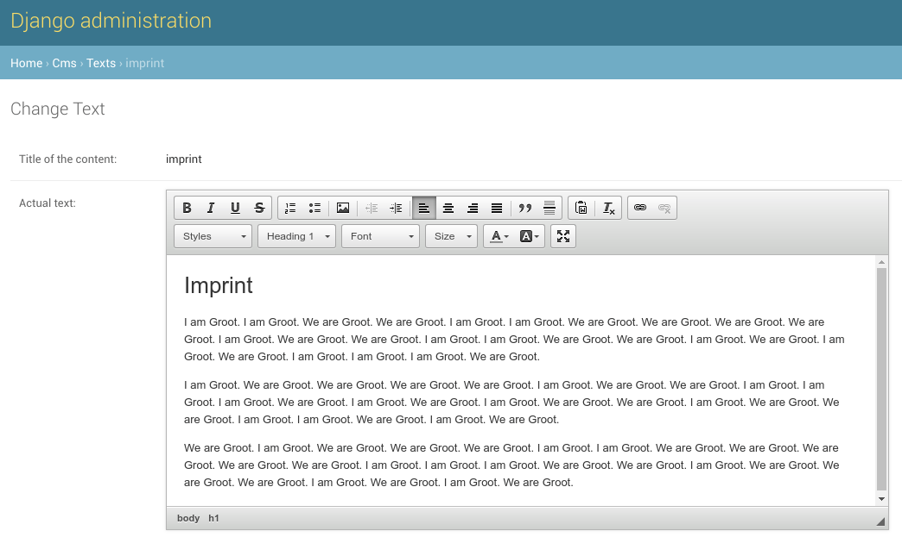

# Django CleanHtmlField

[](https://github.com/anexia-it/django-cleanhtmlfield/actions)

Django CleanHtmlField is a simple Django application (supporting Django
2.2, 3.0 and 3.1) that defines an `HTMLField` that automatically
removes potentially malicious content. This app should work with Python
3.5+.

For instance, if you allow the user to freely input HTML Content, and
the user decides to inject a JavaScript snippet:

```html
<h1>Hello Friend</h1>
<script type="text/javascript">
    steal_all_passwords();
</script>
<p>This is for you!</p>
```

`HTMLField` will filter this to

```html
<h1>Hello Friend</h1>
<p>This is for you!</p>
```

## Quick start

1.  Download and install using `pip install` from [PyPi](https://pypi.python.org/pypi/django-cleanhtmlfield/):

```bash
pip install django-cleanhtmlfield
```

2.  Create a field `HTMLField(strip_unsafe=True)` in your model:

```python
from django.db import models
from django_cleanhtmlfield.fields import HTMLField


class MyModel(models.Model)
    some_content = HTMLField(strip_unsafe=True)
```

3.  Don't forget to create and run migrations for changes on Django
    models, e.g.:


```bash
python manage.py makemigrations
python manage.py migrate
```

## Requirements

For HTML content to be parsed and processed we depend on
`BeautifulSoup4` (this is installed as a dependency). As this is a
Django app, it obviously requires `Django` (though we expect this to be
already installed).

Optional: If you want a WYSIWYG Interface in your Admin Panel (or any
other Django Form), you need the `django-ckeditor` package.




## Field options

* `strip_unsafe` (Default: `False`) needs to be set to `True` to enable stripping of unsafe HTML content
* `widget_form_class` (Default: `None`) - allows overwriting the css form class for the widget (e.g., if you want to use `django-ckeditor`)

## Configuration options

The following Django Settings are available (see below for a full
example)

  - `ACCEPTABLE_ELEMENTS` - tuple that contains all allowed HTML tags
    (e.g., `'a', 'span', 'p', 'div', ...`)
  - `ACCEPTABLE_ATTRIBUTES` - tuple that contains all allowed HTMl
    attributes (e.g., `'alt', 'style', 'target', 'title',...`)
  - `ACCEPTABLE_STYLES` - tuple that contains all allowed CSS styles
    (e.g., `'background-color', 'border-color', 'font-size', ...`)
  - `REMOVE_WITH_CONTENT` - tuple that contains potentially malicious
    HTML tags that will automatically be removed (e.g., `'script',
    'object', ...`)
  - `PRESERVE_STYLES_WHITESPACE` - optional boolean that can be used
    to preserve the whitespace within styles (e.g., `'padding: 9px;'`
    stays `'padding: 9px;'`) - the default behaviour strips the
    whitespaces so (e.g., `'padding: 9px;'` becomes `'padding:9px;'`)

Example:

```python

ACCEPTABLE_ELEMENTS = (
    'a', 'abbr', 'acronym', 'address', 'area', 'aria-label', 'b', 'big',
    'blockquote', 'br', 'button', 'caption', 'center', 'cite', 'code', 'col',
    'colgroup', 'dd', 'del', 'dfn', 'dir', 'div', 'dl', 'dt', 'em',
    'font', 'h1', 'h2', 'h3', 'h4', 'h5', 'h6', 'hr', 'i', 'img',
    'ins', 'kbd', 'label', 'legend', 'li', 'map', 'menu', 'ol',
    'p', 'pre', 'q', 's', 'samp', 'small', 'span', 'strike',
    'strong', 'sub', 'sup', 'table', 'tbody', 'td', 'tfoot', 'th',
    'thead', 'tr', 'tt', 'u', 'ul', 'var', 'iframe', 'section', 'article',
)

ACCEPTABLE_ATTRIBUTES = (
    'abbr', 'accept', 'accesskey',
    'action', 'align', 'alt', 'axis', 'border', 'cellpadding', 'cellspacing',
    'char', 'charoff', 'charset', 'checked', 'cite', 'class', 'clear', 'cols',
    'colspan', 'color', 'compact', 'coords', 'data-mlang', 'data-equation', 'datetime', 'dir',
    'enctype', 'for', 'headers', 'height', 'href', 'hreflang', 'hspace',
    'id', 'ismap', 'label', 'lang', 'longdesc', 'maxlength', 'method',
    'multiple', 'name', 'nohref', 'noshade', 'nowrap', 'prompt',
    'rel', 'rev', 'rows', 'rowspan', 'role', 'rules', 'scope', 'shape', 'size', 'style',
    'span', 'src', 'start', 'summary', 'tabindex', 'target', 'title', 'type',
    'usemap', 'valign', 'value', 'vspace', 'width',
)

ACCEPTABLE_STYLES = (
    'background-color', 'background', 'background-image', 'background-position', 'background-size', 'background-repeat',
    'background-attachment', 'background-origin', 'background-clip',
    'font-family', 'font-size', 'font-weight', 'font-style', 'color',
    'width', 'height', 'min-width', 'max-width', 'min-height', 'max-height', 'line-height',
    'text-decoration', 'text-transform', 'text-align', 'border', 'border-style', 'border-width',
    'border-top', 'border-bottom', 'border-left', 'border-right', 'border-top-style',
    'border-bottom-style', 'border-left-style', 'border-right-style', 'border-top-width',
    'border-bottom-width', 'border-left-width', 'border-right-width',
    'border-color',
    'border-top-color', 'border-bottom-color', 'border-left-color', 'border-spacing', 'border-collapse',
    'border-right-color',
    'border-radius',
    'vertical-align', 'clear', 'float',
    'margin', 'margin-left', 'margin-right', 'margin-top', 'margin-bottom',
    'outline',
    'padding', 'padding-left', 'padding-right', 'padding-top', 'padding-bottom',

)

REMOVE_WITH_CONTENT = ('script', 'object', 'embed', 'style', 'form', )

PRESERVE_STYLES_WHITESPACE = False
```

# Compatibility with Django REST Framework

If you are using Django Rest Framework you need to add the following
code to register a serializer/field handler:

```python
from django.utils.translation import ugettext_lazy as _

from rest_framework import fields
from rest_framework.serializers import ModelSerializer

from django_cleanhtmlfield.fields import HTMLField
from django_cleanhtmlfield.helpers import clean_html

class RestHtmlField(fields.CharField):
    default_error_messages = {
        'invalid': _('"{input}" is not a valid html.')
    }
    default_empty_html = False
    initial = False

    def __init__(self, **kwargs):
        super(RestHtmlField, self).__init__(**kwargs)

    def to_internal_value(self, data):
        return clean_html(data, strip_unsafe=True)


ModelSerializer.serializer_field_mapping[HTMLField] = RestHtmlField
```

## Compatibility Matrix

This library should be compatible with the latest Django and Django Rest Framework Versions. For reference, here is
a matrix showing the guaranteed and tested compatibility.

django-cleanhtmlfield Version | Django Versions | Django Rest Framework Versions | Python |
--------------------------------- | --------------- | ------------------------------ | ------ |
1.0 | 2.2, 3.0, 3.1 | 3.6 - 3.11 | 3.5 - 3.8

# License

[MIT License](LICENSE)

# Development and Tests

The test app is located in the `tests` subfolder.
